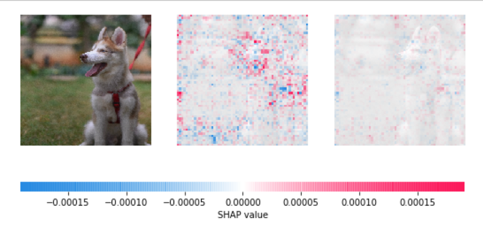
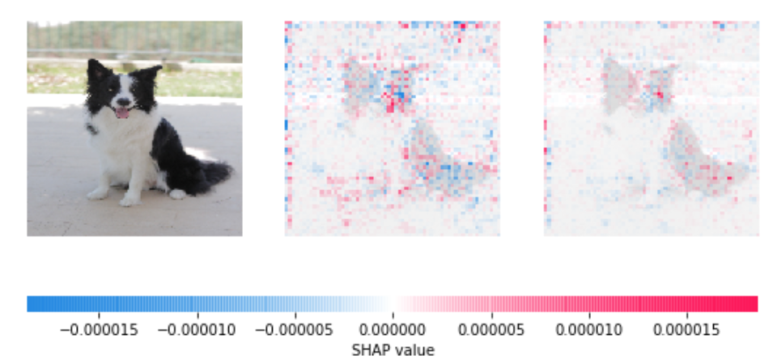

# Dog Breed Identification - Michael Suttles

## Introduction

* Animal shelters around the country could benefit from a system that easily identifies a dog by its breed—especially in cases where the dog is a mixed breed.
* I used a convolutional neural network for image classification of dog breed.
* I used TensorFlow in Python to implement the CNN, and Shapley Additive Explanations [github.com/slundberg/shap]((SHAP)) to interpret the model.

## Data Sources

* I scraped Google Images for the dataset of 35 breed images
  * about 400 images per breed
* I added the [vision.stanford.edu/aditya86/ImageNetDogs/](Stanford dog breed dataset) images
  * 100-200 images per breed, but some breeds not included

## Optimizing the algorithm

* Tweak different parameters, including:
  * How large the image is that the CNN is finding features from? 244x244 pixels, 350x350, etc.
  * What do you do to the image? Crop, zoom, skew...
  * The structure of the “fully connected layers” at the end
  * How many times (“epochs”) it should run
* Improved accuracy from 70% to 80% for 35 breeds

## Results

* 3 breed model: 95.7% accuracy
* 35 breed model: 80% accuracy

## How the neural net “sees” the image

## Future work

* Further refine model to account for errors (for example, along border of image).
* Implement a 152-layer ResNet model instead of a 50-layer model, which has been shown to have the highest degree of accuracy.
* Look into an ensemble model, which can result in higher accuracy.

## For further information

* Email: [mailto:michael@doggydatazone.com](michael@doggydatazone.com)
* LinkedIn: [linkedin.com/in/michaelgsuttles](linkedin.com/in/michaelgsuttles)
* Website: [www.doggydatazone.com](www.doggydatazone.com)

